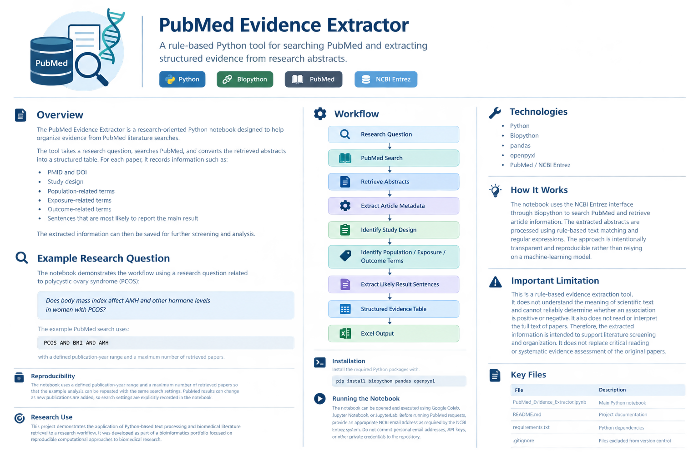

# 🧬 PubMed Evidence Extractor

A rule-based Python tool for searching PubMed and extracting structured evidence from research abstracts.

[](https://www.python.org/)
[](https://biopython.org/)
[](https://pubmed.ncbi.nlm.nih.gov/)


<p align="center">
  
</p>


## 🔬 Overview

The **PubMed Evidence Extractor** is a research-oriented Python notebook designed to help organize evidence from PubMed literature searches.

The tool takes a research question, searches PubMed, and converts retrieved abstracts into a structured table. For each paper, it records:

* 🆔 PMID
* 🔗 DOI
* 🧪 Study design
* 👥 Population-related terms
* 📌 Exposure-related terms
* 🎯 Outcome-related terms
* 📄 Sentences most likely to report the main result

The extracted information can then be saved for further screening and analysis.

## 🔎 Example Research Question

The notebook demonstrates the workflow using a research question related to polycystic ovary syndrome (PCOS):

> Does body mass index affect AMH and other hormone levels in women with PCOS?

The example PubMed search uses:

```text
PCOS AND BMI AND AMH
```

with a defined publication-year range and a maximum number of retrieved papers.

## ⚙️ Workflow

```text
Research Question
       ↓
PubMed Search
       ↓
Retrieve Abstracts
       ↓
Extract Article Metadata
       ↓
Identify Study Design
       ↓
Identify Population / Exposure / Outcome Terms
       ↓
Extract Likely Result Sentences
       ↓
Structured Evidence Table
       ↓
Excel Output
```

## 🛠️ Technologies

* 🐍 Python
* 🧬 Biopython
* 📊 pandas
* 📗 openpyxl
* 🔎 PubMed / NCBI Entrez

## 💡 How It Works

The notebook uses the NCBI Entrez interface through Biopython to search PubMed and retrieve article information.

The extracted abstracts are processed using rule-based text matching and regular expressions. The tool identifies predefined words and patterns related to study design, population, exposure, outcomes, and reported results.

The approach is intentionally transparent and reproducible rather than relying on a machine-learning model.

## ⚠️ Important Limitation

This is a **rule-based evidence extraction tool**.

It does not understand the meaning of scientific text and cannot reliably determine whether a reported association is positive or negative. It also does not read or interpret the full text of papers.

Therefore, the extracted information is intended to support literature screening and organization. It does **not** replace critical reading or systematic evidence assessment of the original papers.

## 🔁 Reproducibility

The notebook uses a defined publication-year range and a maximum number of retrieved papers so that the example analysis can be repeated with the same search settings.

PubMed results can change as new publications are added, so search settings are explicitly recorded in the notebook.

## 📁 Repository Contents

| File                                   | Description                                           |
| -------------------------------------- | ----------------------------------------------------- |
| `PubMed_Evidence_Extractor.ipynb`      | Main Python notebook containing the complete workflow |
| `README.md`                            | Project documentation                                 |
| `requirements.txt`                     | Python dependencies                                   |
| `.gitignore`                           | Files and folders excluded from version control       |
| `assets/pubmed-evidence-extractor.png` | Project overview graphic                              |

## 📦 Installation

Install the required Python packages with:

```bash
pip install biopython pandas openpyxl
```

## ▶️ Running the Notebook

The notebook can be opened and executed using:

* Google Colab
* Jupyter Notebook
* JupyterLab

Before running PubMed requests, provide an appropriate NCBI email address as required by the NCBI Entrez system.

Do not commit personal email addresses, API keys, or other private credentials to the repository.

## 🧪 Research Use

This project demonstrates the application of Python-based text processing and biomedical literature retrieval to a research workflow.

It was developed as part of a bioinformatics portfolio focused on reproducible computational approaches to biomedical research.
